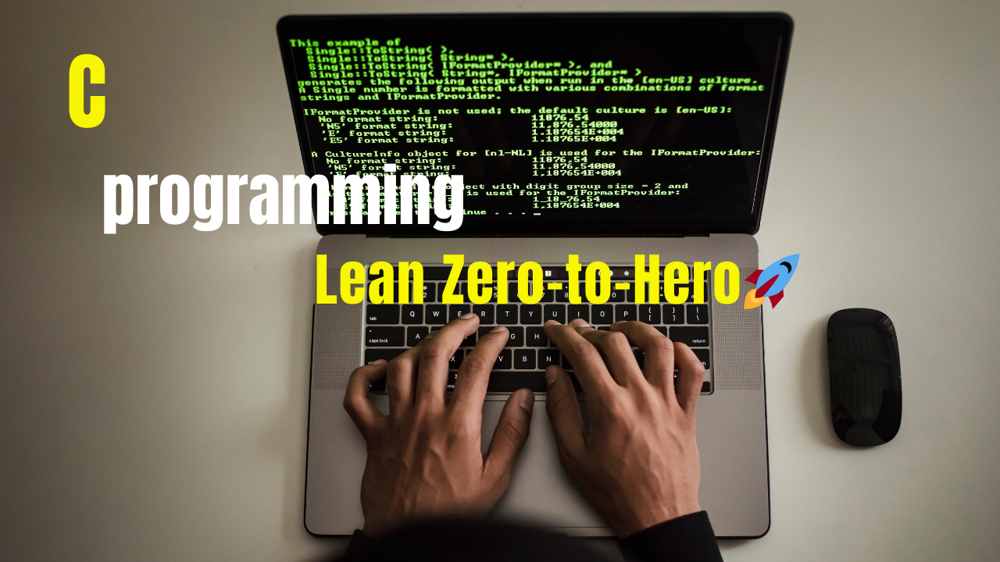

# C Programming: Zero to Hero
**Learn C programming from scratch with examples and projects.**

## Quick Links
- [Getting Started](#getting-started)
- [Practices question](https://github.com/ishanwalia7579/C-programming-Zero-to-Hero-/blob/main/Practices%20questions%20for%20c%20programming.md)
- [Projects](#projects)
- [MCQS Most Important](# ).
<br>

.
## Table of Contents
- [Introduction](#introduction)
- [Basic Programs](#basic-programs)
- [Advanced Topics](#advanced-topics)
<br>
<h2>* What is c programming define ?</h2> <br>
<ul>
  <li>C is general purpose programming language reated by <strong>Dennie Ritchie</strong> at the Bell Laboratories in 1972</li>
  <li>It is a very popular language ,despite being old</li>
  <li>The main raeson for its popularity is beacuse it is a fundamental language in the feild of computer science</li>
</ul>
<br>
<br>

<h2>* Print ("Hello world")?<br>
  
```bash
  #include <stdio.h>
  int main(){
  printf("Hello World");
  reture 0;
  }
```
</h2>
<h3>* Introduction to Indentifiers in C</h3>
<p>Identifiers are the names used to identify variable,functions,arrays,or other user-defined elements in a C program.</p>
<h4>* Rules for Identifiers :-</h4>
<ol>
  <li>Must begin with a letter (A-Z) or (a-z) or  an underscore(_) .</li>
  <li>Cannot use C keywords.</li>
  <li>Can cantain letter,digit (0-9),and underscores (_(.</li>
  <li>Case-sensitive.</li>
</ol>
<br>
<h2>* The basic concepts of C programming language</h2>
<ul>
  <li>Variables</li>
  <li>Keywords</li>
  <li>Constants</li>
  <li>Structure</li>
  <li>Compilation</li>
</ul>
<br>
<h3>1. Variables</h3>
<p><li>A Varaiable is a container to store data values it is defined by a name,types memory location.</li></p>
<br> <h4>Declaration syntax :-</h4>

```c
datatypen variable_name;
```
<p>Example :-</p>

```c
1.int num;
2.float pi;
3. char grade;
```
<h2>* Variable Rules:-</h2>
<ol>
  <li>Variable are case sensitive.</li>
  <li>1st Character is alphabet or '_'.</li>
  <li>No comma / blank space.</li>
<li>No other symbol other that '_'.</li>
</ol>
<br>
<h2>* Different types of variables:-</h2>
<ol>
  <li>Local variables</li>
  <li>Global variables</li>
  <li>Static variables</li>
  <li>External variables</li>
</ol>
<h4> 1. Local variables </h4>
<p>Local variables are declared inside a function and can only be accessed with in that function.</p>

```c
#include <stdio.h>

void display() {
    int number = 10; // Local variable
    printf("The local variable value is: %d\n", number);
}

int main() {
    display(); // Calling the function
    return 0;
}

```
<h4>2. Global variables</h4>
<p>Global variables are declared outside all functions and are accessible by all functions in the program .</p>

```c
#include <stdio.h>

// Global variable declaration
int globalNumber = 10;

void increment() {
    globalNumber += 5; // Modify the global variable
    printf("Value after increment: %d\n", globalNumber);
}

void decrement() {
    globalNumber -= 3; // Modify the global variable
    printf("Value after decrement: %d\n", globalNumber);
}

int main() {
    printf("Initial value: %d\n", globalNumber);
    increment(); // Call increment function
    decrement(); // Call decrement function
    return 0;
}

```
<h4>3. Static  variables</h4>
<p>Static variables retain their value between function calls and are initialized only ..</p>

```c
#include <stdio.h>

void counter() {
    static int count = 0; // Static variable
    count++;
    printf("Count value: %d\n", count);
}

int main() {
    counter(); // First call
    counter(); // Second call
    counter(); // Third call
    return 0;
}

```
<h4>4. External variables</h4>
<p>External variables are declared using the extern keyword they allow sharing variables across multiple files ..</p>

```
```
<h4>4. Automatic variable</h4>
<p> ..</p>

```
```
<br><hr>
<h2>2. Keywords :-</h2>
<p><li>Reserved words that have special meaning to the compiler <strong>32</strong> keywords in C</li></p>
<br><hr>

<h2>3.Constants in C</h2>
<p><li>Constants are fixed values that do not change during program execution ..</li></p>
<h4> * Types for constants:-</h4>
<li>Integer Conatants</li>
<li>Floating-point Constants </li>
<li>Character Constants </li>
<li>String Constants</li>
<br>
<h4>1. Integer Conatants :-</h4>
<p>Whole number eg:-10,52</p>

```c
#include <stdio.h>
int main(){
    int a;
    printf("Enter a number is integer :"); // user for integer constant
    scanf("%d",&a);
    printf("%d",a);
    return 0;
}
```
<h4>2. Floating -point Constants :-</h4>
<p>Decimal number eg:- 3.14</p>

```
#include <stdio.h>
int main(){
    float a;
    printf("Enter a float point number :"); // user for Floating-point constant
    scanf("%f",&a);
    printf("%f",a);
    return 0;
}
```
<h4>3. Character Constants :-</h4>
<p>Single characters in single quotes  eg:- 'A'</p>

```
#include <stdio.h>
int main(){
    char a;
    printf("Enter a Character number :"); // user for Character constant
    scanf("%c",&a);
    printf("%c",a);
    return 0;
}
```

<br><hr>
<h3>4. Comments :-</h3>
<p>Lines that are not part of program</p>
<h4>* Types of comments :-</h4>
<ul>
  <li>Single Line</li>
  <li>Multiple Line</li>
</ul>
  <br>
  
```c
      // This single line comments
      /* This is multiple line */
```

<br>
<h3> Variable print -</h3><p>variable used for print ("%d")</p><br>

<h3>
  
```c
#include <stdio.h>
int main() {
    int myNum=100;
    printf("%d",myNum);
    return 0;
}
```
</h3>
<br>
<h3>Multiple variable-</h3>To declare more than one variable of the same type,use a comma-separates list:-

<h3>
  
```c
#include <stdio.h>
int main() {
   int x=100 , y=200 ,z=300;
   printf("%d",x+y+z);
    return 0;
}
```
</h3><br>
<br><hr>
<h3>5. Output </h3>
<p>Cases</p>
<ol>
  <li>Integer :-</li>
  
  ```c
#include <stdio.h>
int main() {
    printf("age is %d",age); // This is Integer define ("%d")
    return 0;
}
```
<br>
  <li>Real Number :-</li>

  ```c
#include <stdio.h>
int main() {
    printf("value of pi is %f", pi);  // This is Real number define ("%f")
    return 0;
}
```
<br>
  <li> Characters :-</li>

  ```c
#include <stdio.h>
int main() {
    printf("star looks like thin %c",star);   // This character define ("%c")
    return 0;
}
```

</ol>
<br><hr>
<h3>6. Input :-</h3>

```c
#include <stdio.h>
int main() {
    scanf("%d",&age);    // This is Input
    return 0;
}
```
<br><hr>
<h3>7. Compilation :-</h3>
A computer program that translates C code into machine code
<br><hr>
<h3>8.Instruction :-</h3><p>These are statements in a program</p>
<h5> *Types of Instruction :-</h5>
<ul>
  <li>Declaration Instruction</li>
  <li>Arithmetic Instruction</li>
  <li>Control Instruction</li>
</ul>
<br>
<h4> 1.Declaration Instruction</h4><P>Declare var before using it</P>

```c
int a=22;
int b=a;
int c=b+1;
int d=1,e;
```
</h4><br>
<h4>2.Arithmetic Instructions :-</h4>

```c
a=b+c
a=b*c
a=b/c
a=b%c
```
<br><hr>
<h3>3.Control Instructions -:</h3><p>Used to determine flow of program</p>
<ul>
  <li>Sequence control</li>
  <li>Decision control</li>
  <li>Loop control</li>
  <li>Case control</li>
</ul>
<br><hr>
<h3>9.Conditional Statements :-</h3><p>Conditional Statements allow you to make a decision based on the 'if-else' or 'switch'</p>
<h5>*Type of Conditional statements :-</h5>
<ul>
  <li>If</li>
  <li>If-else</li>
  <li>If-else-if</li>
  <li>Nested-if</li>
  <li>Switch</li>
</ul>
<br>
<br>
<h4>1. How to used for 'if-else'</h4>

```c
      #include <stdio.h>
      int main(){
      int age;
      printf("Enter a age :");
      scanf("%d",&age);
      
      if(age >18){
      printf("adult \n");
      printf("They are vote \n");
      printf("They are drive \n");
      }
      else{
      printf("Not adult \n");
      }
      printf("Thank You");
      return 0;
```
<br>
<h4>2. How to used for 'switch' </h4>

```c
      #include <stdio.h>
      int main(){
      int day;
      printf("Enter a day(1-7) :");
      scanf("%d",&day);
      
      switch (day){
      case 1: printf("Monday \n");
             break;
      case 2: printf("Tuesday \n");
             break;
      case 3: printf("Wednesday \n");
             break;
      case 4: printf("Thursday \n");
             break;
      case 5: printf("Friday \n");
             break;
      case 6: printf("Saturday \n");
             break;
      case 7: printf("Sunday \n");
             break;
      default :printf("Not a valid days");
      return 0;
      }
      }
```
<br><hr>
<h3> Loop Control Instruction :-</h3>
<p>To repeat some parts of the program</p>
<h5>* Type of Loop Control Instruction :-</h5>
<ol>
  <li>For Loop</li>
  <li>While</li>
  <li>Do While</li>
</ol>
<h4> 1.for Loop</h4>

```c
      #include <stdio.h>
      int main(){
          for( int i=1; i<=10; i=i+1){
          printf("Hello World \n");
      }
      return 0;
      }
```
